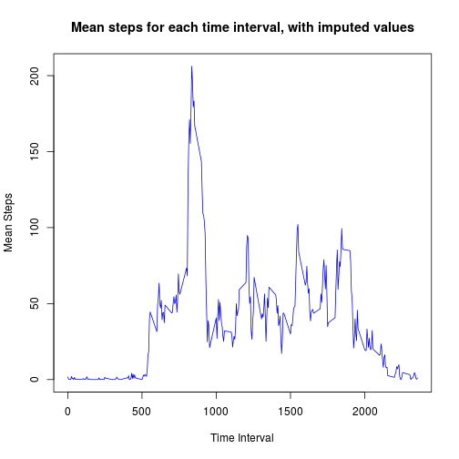
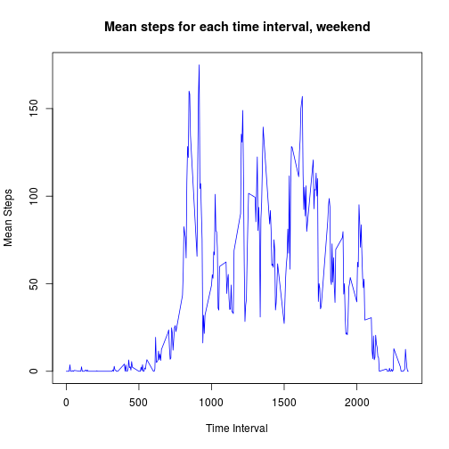
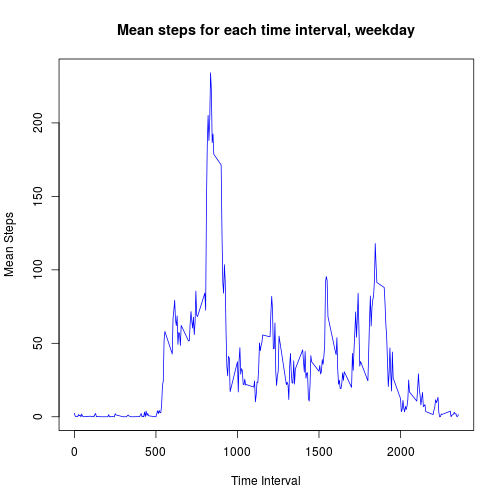
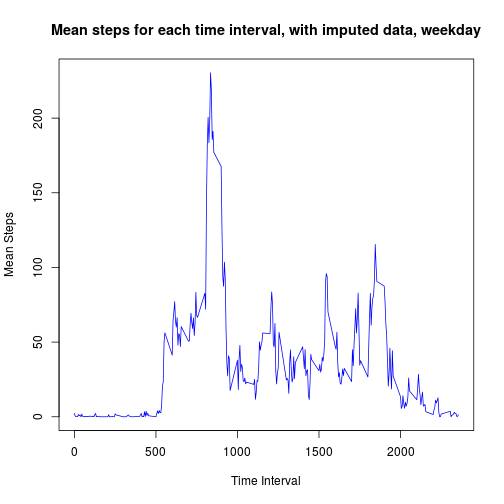

## Introduction

Data collected from a personal device that keeps track of how many steps an individual takes can offer interesting insight into their patterns of activity over time. In the wrong hands, this data could be used for invasive monitoring and surveillance. 

In this case, the data was collected from an anonymous individual over the period from 2012-10-01 to 2012-11-30. Some of the data was missing, and was imputed in order to create a complete set.

## Processing the data


```r
#read in the CSV file
activity <- read.csv("activity.csv")

#to stop R from converting numbers to scientific notation
options("scipen"=100, "digits" = 2)
```

##Some aggregation


```r
#aggregating data
daily.steps <- aggregate(FUN = sum, x = activity$steps, by = list(activity$date), na.rm = TRUE)
daily.steps <- setNames(daily.steps, c("Date", "Total.Steps"))

interval.steps <- aggregate(FUN = sum, x = activity$steps, by = list(activity$interval), na.rm = TRUE)
interval.steps <- setNames(interval.steps, c("Interval", "Total.Steps"))

mean.interval.steps <- aggregate(FUN = mean, x = activity$steps, by = list(activity$interval), na.rm = TRUE)
mean.interval.steps <- setNames(mean.interval.steps, c("Interval", "Mean.Steps"))

median.daily.steps <- median(daily.steps$Total.Steps)
mean.daily.steps <- mean(daily.steps$Total.Steps)

#daily total steps histogram
hist(daily.steps$Total.Steps, breaks = 20, xlab = "total steps", main = "Daily Total Steps")
```

 

The mean daily steps taken is ***9354.23***. The median is ***10395***.

##Average Daily Pattern


```r
#get the means for each time interval
interval.mean <- aggregate(FUN = mean, activity$steps,  by = list(activity$interval), na.rm = TRUE)
interval.mean <- setNames(interval.mean, c("Interval", "Mean.Steps"))
#find which interval has the biggest mean
max.mean.interval.step <- interval.mean[which.max(x = interval.mean$Mean.Steps),]
#make time plot
plot(mean.interval.steps, type = 'l', col = "Blue", main = "Mean steps for each time interval", xlab = "Time Interval", ylab = "Mean Steps")
```

 

The time interval with the biggest mean number of steps is ***835***, with ***206.17***.


##Missing values


```r
#get number of values where there's an NA instead of a number
missing.vals <- sum(is.na(activity$steps))
```

The number of missing values in the data is ***2304***.


```r
#define a function to return the mean number of steps for a given time interval
get.mean <- function(interval) {
  mean.interval.steps$Mean.Steps[mean.interval.steps$Interval == interval]
}

#define a function to insert imputed steps into a new column
impute.steps <- function(act) {

  steps <- act$steps
  intervals <- act$interval
  imputed.steps <- c(1:length(steps))
  for (i in 1:length(steps)) {
    ifelse(is.na(steps[i]), imputed.steps[i] <- get.mean(intervals[i]), imputed.steps[i] <- steps[i])
  }  
  imputed.steps
}

#create a data frame and update the steps values to contain imputed data
imp.activity <- activity
imp.activity$steps <- impute.steps(activity)
```


```r
imputed.interval.mean <- aggregate(FUN = mean, imp.activity$steps,  by = list(imp.activity$interval), na.rm = TRUE)
imputed.interval.mean <- setNames(imputed.interval.mean, c("Interval", "Mean.Steps"))


#time plot with imputed steps
imputed.mean.interval.steps <- aggregate(FUN = mean, x = imp.activity$steps, by = list(activity$interval), na.rm = TRUE)
imputed.mean.interval.steps <- setNames(imputed.mean.interval.steps, c("Interval", "Mean.Steps"))

#find which interval has the biggest mean
#make time plot
plot(imputed.mean.interval.steps, type = 'l', col = "Blue", main = "Mean steps for each time interval, with imputed values", xlab = "Time Interval", ylab = "Mean Steps")
```

 

## Are there differences in activity patterns between weekdays and weekends?

###First with the non-imputed data

```r
#create weekend values with non-imputed data
activity$day <- ifelse(weekdays(as.Date(activity$date)) %in% c("Saturday", "Sunday"), "Weekend", "Weekday")
activity$day <- as.factor(activity$day)
weekend.days <- activity$day == "Weekend"
weekday.days <- activity$day == "Weekday"
weekend.means <- aggregate(FUN = mean, x = activity$steps[weekend.days], by = list(activity$interval[weekend.days]), na.rm = TRUE)
weekday.means <- aggregate(FUN = mean, x = activity$steps[weekday.days], by = list(activity$interval[weekday.days]), na.rm = TRUE)

#plot the mean values
plot(weekend.means, type = "l", col = "Blue", main = "Mean steps for each time interval, weekend", xlab = "Time Interval", ylab = "Mean Steps")
```

 

```r
plot(weekday.means, type = "l", col = "Blue", main = "Mean steps for each time interval, weekday", xlab = "Time Interval", ylab = "Mean Steps")
```

 

###Now with imputed data...

```r
#create weekday and weekend values with imputed data
imp.activity$day <- ifelse(weekdays(as.Date(imp.activity$date)) %in% c("Saturday", "Sunday"), "Weekend", "Weekday")
imp.activity$day <- as.factor(imp.activity$day)
imp.weekend.means <- aggregate(FUN = mean, x = imp.activity$steps[weekend.days], by = list(imp.activity$interval[weekend.days]))
imp.weekday.means <- aggregate(FUN = mean, x = imp.activity$steps[weekday.days], by = list(imp.activity$interval[weekday.days]))
plot(imp.weekend.means, type = "l", col = "Blue", main = "Mean steps for each time interval, with imputed data, weekend", xlab = "Time Interval", ylab = "Mean Steps")
```

 

```r
plot(imp.weekday.means, type = "l", col = "Blue", main = "Mean steps for each time interval, with imputed data, weekday", xlab = "Time Interval", ylab = "Mean Steps")
```

 

It certainly looks like there are differences between the weekend and weekdays, in terms of walking activity, with the weekend generally being more active, but starting later, than during the week.

